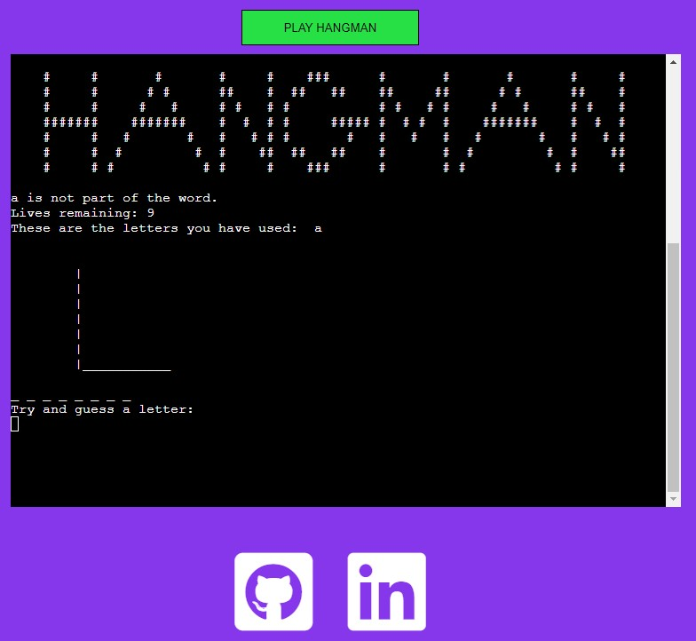
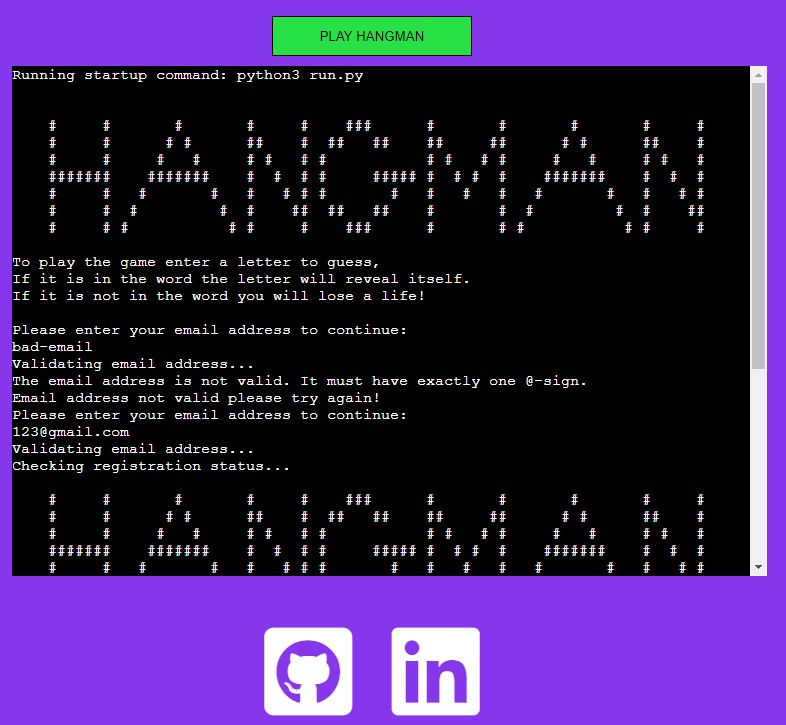

# Hangman Game

(Developer: Benjamin Draper)

 [Live webpage](https://ben-hangman.herokuapp.com/)

## About

This is a command-line version of the game Hangman, the objective of the game is to guess the word before the number of lives you have run out and your virtual man is hung.

## Table of Content
1. [Project Goals](#project-goals)
    1. [User Goals](#user-goals)
    2. [Site Owner Goals](#site-owner-goals)
2. [User Experience](#user-experience)
    1. [Target Audience](#target-audience)
    2.  [User Requirements and Expectations](#user-requirements-and-expectations)
    3. [User Manual](#user-manual)
3. [User Stories](#user-stories)
    1. [Users](#users)
    2. [Site Owner](#site-owner)
4. [Design](#design)
    1. [Flow Diagram](#flow-diagram)
5. [Technologies Used](#technologies-used)
    1. [Languages](#languages)
    2. [Frameworks and Tools](#frameworks-and-tools)
    3. [Libraries](#libraries)
        - [Python Libraries](#python-libraries)
        - [Third Party Libraries](#third-party-libraries)
6. [Features](#features)
    1. [User Login](#user-login)
    2. [How To Play](#how-to-play)
    3. [Game Options](#game-options)
    4. [Game](#game)
7. [Validation](#validation)
8. [Testing](#testing)
    1. [Manual Testing](#manual-testing)
    2. [Automated-testing](#automated-testing)
9. [Bugs](#Bugs)
10. [Deployment](#deployment)
11. [Credits](#credits)
12. [Acknowledgements](#acknowledgements)

## Project Goals

### User Goals
1.	To have a fun and easy game to play.
2.	To be able to how to play
3.	To be able to create an account and track the score.
### Site Owner Goals
1.	Create a game that is intuitive to use.
2.	Ensure the users understand the objective of the game.
3.	Give the user feedback while they are playing the game.

[Back to Table Of Content](#table-of-content)

## User Experience

### Target Audience
The Target audience for the game is not specific to any group of individuals, the game can be played by anyone who is looking for an entertaining way to pass some time. It would be best suited to people who are about the age of 10 years old due to the word selection used, younger people might find it quite difficult.

### User Requirements and Expectations
1.	The user can expect an easy-to-use bug free game.
2.	The user can expect to find straightforward navigation and guidance.
3.	The user can expect to see personalised user information when logging into their account and their access to their total score.
4.	The user can except to see feedback on the game as it runs and the result.

### User Manual
The user is given a short description for how to play the game when you login to your account. Throughout the game you are given guidance to make the game user friendly. You are always shown what letters you have already used and how many lives you have left.
When navigating through the menu’s you are given your options or asked to enter a specific input into the terminal to continue with the game.

[Back to Table Of Content](#table-of-content)

## User Stories

### Users
1.	I want clear options to select in all the game menus.
2.	I want to be able to read how to play the game.
3.	I want to be able to log in to my account.
4.	I want to be to log back into my account when I return to the game.
5.	I want to receive feedback throughout the game.
6.	I want to get feedback when I win the game.
7.	I want to be able to play multiple games when I'm logged in.
8.	I want to see how many games I've won so far.

### Site Owner
9.	I want users to have a good experience when they are playing the game.
10.	I want users to be able to easily select options from all menus throughout the game.
11.	I want all emails, usernames, and scores to be saved in a Google spreadsheet.
12.	I want the user to see feedback from the game when they enter the wrong letter in the game.
13. I want the user to receive feedback from the game when they enter an invalid answer.

[Back to Table Of Content](#table-of-content)

## Design

### Flow Diagram
This diagram shows the structure and flow of the game logic within the application.

Flow diagram

[Back to Table Of Content](#table-of-content)

## Technologies Used

### Languages
- [Python](https://www.w3schools.com/python/default.asp) language for the structure, logic and decision making of the game.
- [HTML](https://www.w3schools.com/html/default.asp) and [CSS]( https://www.w3schools.com/css/default.asp) used for the small edits made to the template files provided by Code Institute to customize the look of the terminal page.

### Frameworks and Tools
- [Diagrams.net](https://app.diagrams.net/) was used to create my flow diagram.
- [GitHub](https://github.com/) is being used as my repository to store all of my code and manage version control.
- [Google Cloud Platform](https://cloud.google.com/cloud-console/) was used to store and create the access credentials for the google sheet storing the user information.
- [Google Sheets](https://www.google.co.uk/sheets/about/) is being used for storing player details.
- [Heroku Platform](https://dashboard.heroku.com/) is used to deploy the project to a live environment.
- [PEP8](http://pep8online.com/) has been used to verify all the code against python coding standards.

### Libraries

#### Python Libraries
- os is used to allow me to clear the terminal for different types of operating systems.
- random is used to randomize the word used within the game, I used a selection of predefined words that it can select randomly select from.
- string is used to ensure that all the characters entered by the player weather they are uppercase, or lowercase are interpreted as a lowercase character to prevent errors.
- [unittest](https://docs.python.org/3/library/unittest.html) – used to carry out automated testing on the validation.py file

#### Third Party Libraries
- [email_validator](https://pypi.org/project/email-validator/) – JUSTIFICATION: I used this library to make sure the player had entered a valid email address when signing up for an account.
- [gspread](https://docs.gspread.org/en/latest/) – JUSTIFICATION: I used gspread to allow access to and edit the data in my google spreadsheet storing the player information
- [google.oauth2.service_account](https://google-auth.readthedocs.io/en/master/) – JUSTIFICATION: This is a required part of the Google API to allow access to the game the authorization to access the spreadsheet, during development I used a creds.json file and in Heroku I have saved the contents of this file in the config vars section.

[Back to Table Of Content](#table-of-content)

## Features

### User Login
- Asks the player for their email address to login.
- informs them if the email they input is not in the correct format.
- Shows the user their score from previous games they have played.
- User stories covered: 3, 4, 8, 13

User Login Screenshot

Incorrect Login format Screenshot

### User Sign Up
- Provides the ability for a user to login or create a new account from their email address.
- Saves the player to a Google Spreadsheet to be recalled when needed.
- User stories covered: 3, 4, 11

 User Sign Up Screenshot

Player Database Screenshot

### How To Play
- Explains to the user how to play the game and navigate through the menus.
- Is displayed before the user must interact with any menu or the main game.
- User stories covered: 1, 2, 9,10

How To Play Screenshot

### Game Options
- Gives the player clear instructions throughout the game to help them play the game.
- User stories covered: 1, 5, 9, 10

Game Options Screenshot

### Email Validation
- Takes the user input email address validates against a template
- Asks the user to re-enter the email address if it is incorrect
- If it is valid it passes and allows the user to either log in or create a user
- User stories covered: 1, 3, 5, 9, 13

 Email Validation Screenshot

### Welcome Message
- This is a message that is displayed before the player has logged into their account
- The message explains how to play the game and asks the player to login
- User stories covered: 1, 2, 3, 4, 9

 Welcome Message Screenshot

### Input Validation
- Informs the player when they enter an invalid character into a prompt or menu with the game
- Will not allow the user to progress forwards without a correct input
- Asks the user to try their input again
- User stories covered:1, 5, 9, 10, 12, 13

 Input Validation Screenshot

### Game
- Displays the title created for the game.
- Displays the numbers of lives remaining for the player.
- Displays the Letters that have already been used within this game.
- Displays the status of the gallows and the man getting hung.
- Displays the status of the word being guessed.
- Displays a warning when an invalid character is entered.
- Tells the player when the enter a letter that is not in the word.
- Provides feedback when the game has been won.
- Gives the option to play again and prints the users total score after the game is finished.
- User stories covered: 1, 5, 6, 7, 8, 12, 13

Game Screenshot

Invalid Character Screenshot

Game Won Screenshot

Next Game Screenshot

[Back to Table Of Content](#table-of-content)

## Validation

[PEP8 Validation Service](http://pep8online.com/) has been used to check the code for PEP8 requirements, my code passes with no errors and no warnings to show.

run.py PEP8 check

 validation.py PEP8 check 

testing.py PEP8 check 

[Back to Table Of Content](#table-of-content)

## Testing

The approach I decided to take to test this project was to manually test the user stories myself and get another individual to follow the same actions, using different credentials when logging in to test the game.

After this I decided to use an automated testing library called unittest to test my validation file. This involves building tests to allow the game to step through and test the functions within the validation file that I have targeted.

### Manual Testing
This section follows the user story structure and will test each user story against its own scenario.

1. I want clear options to select in all the game menus.

| **Feature**   | **Action**                    | **Expected Result**          | **Actual Result** |
| ------------- | ----------------------------- | ---------------------------- | ----------------- |
| How To Play | When the game is opened read the instructions how to play the game | User can read and understand how the game and menus should be navigated | Works as expected |
| Game Options | At each prompt the player can read the instructions given to guide them to the correct goal | User can read and understand how to navigate forward | Works as expected |
| Email Validation | The user enters a incorrect email address | The game identifies the email is not correct and asks the player to try again before continuing | Works as expected |
| Welcome Message | When the game is opened, view the welcome message, and read the instructions how to play the game | User can read and understand how the game and menus should be navigated | Works as expected |
| Input Validation | The user enters a incorrect character at a given prompt | The game identifies the character is invalid and asks the player to try again before continuing | Works as expected |
| Game | The player enters a valid character into the game | The game either reveals the letter within the word or the player loses a life | Works as expected |

Screenshots

2. I want to be able to read how to play the game.

| **Feature**   | **Action**                    | **Expected Result**          | **Actual Result** |
| ------------- | ----------------------------- | ---------------------------- | ----------------- |
| How To Play | When the game is opened read the instructions how to play the game | User can read and understand how the game and menus should be navigated | Works as expected |
| Welcome Message | When the game is opened, view the welcome message and  read the instructions how to play the game | User can read and understand how the game and menus should be navigated | Works as expected |

Screenshots

3. I want to be able to log in to my account.

| **Feature**   | **Action**                    | **Expected Result**          | **Actual Result** |
| ------------- | ----------------------------- | ---------------------------- | ----------------- |
| User Login | On the welcome message screen the player can type in their email address to sign into their account |User signs into their account | Works as expected |
| User Sign Up | On the welcome message screen the player can type in their email address and name to sign up for a new account |User signs up for a new account | Works as expected |
| Email Validation | On the welcome message screen the player can type in their email address to sign into their account |User signs into their account, the game verifies that the email is correct | Works as expected |
| Welcome Message | On the welcome message screen the player can type in their email address to sign into their account |User signs into their account | Works as expected |

Screenshots

4. I want to be to log back into my account when I return to the game.

| **Feature**   | **Action**                    | **Expected Result**          | **Actual Result** |
| ------------- | ----------------------------- | ---------------------------- | ----------------- |
| User Login | On the welcome message screen the player can type in their email address to sign into their account |User signs back into their account | Works as expected |
| User Sign Up | On the welcome message screen the player can type in their email address and name to sign up for a new account |User signs up for a new account | Works as expected |
| Welcome Message | On the welcome message screen the player can type in their email address to sign into their account |User signs back into their account | Works as expected |

Screenshots

5. I want to receive feedback throughout the game.

| **Feature**   | **Action**                    | **Expected Result**          | **Actual Result** |
| ------------- | ----------------------------- | ---------------------------- | ----------------- |
| Game Options |At the prompt to start a new game the user chooses to start a new game or quit |The User either starts a new game or quits back to the welcome message | Works as expected |
| Email Validation | On the welcome message screen the player can type in their email address to sign into their account |User signs into their account, the game verifies that the email is correct | Works as expected |
| Input Validation | The user enters a incorrect character at a given prompt | The game identifies the character is invalid and asks the player to try again before continuing | Works as expected |
| Game | The player enters a valid character into the game | The game either reveals the letter within the word or the player loses a life | Works as expected |

Screenshots

6. I want to get feedback when I win the game.

| **Feature**   | **Action**                    | **Expected Result**          | **Actual Result** |
| ------------- | ----------------------------- | ---------------------------- | ----------------- |
| Game | The player enters the final character into the game | The game either reveals the word and tells the player they have won the game | Works as expected |

Screenshots

7. I want to be able to play multiple games when I'm logged in.

| **Feature**   | **Action**                    | **Expected Result**          | **Actual Result** |
| ------------- | ----------------------------- | ---------------------------- | ----------------- |
| Game | The player enters the final character into the game | The game either reveals the word and tells the player they have won the game, displaying a prompt asking if they would like to play again | Works as expected |

Screenshots

